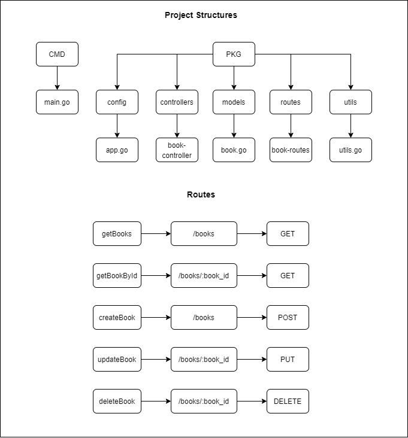

# Book Management System API
[](https://golang.org/)

## Quick Start
---
```
# Run App
go run cmd/main.go
```

## Project Diagram
---


### Stack
---
-  Mux Router -> github.com/gorilla/mux
-  GORM -> github.com/jinzhu/gorm
-  MySQL -> github.com/go-sql-driver/mysql
-  Env -> github.com/joho/godotenv